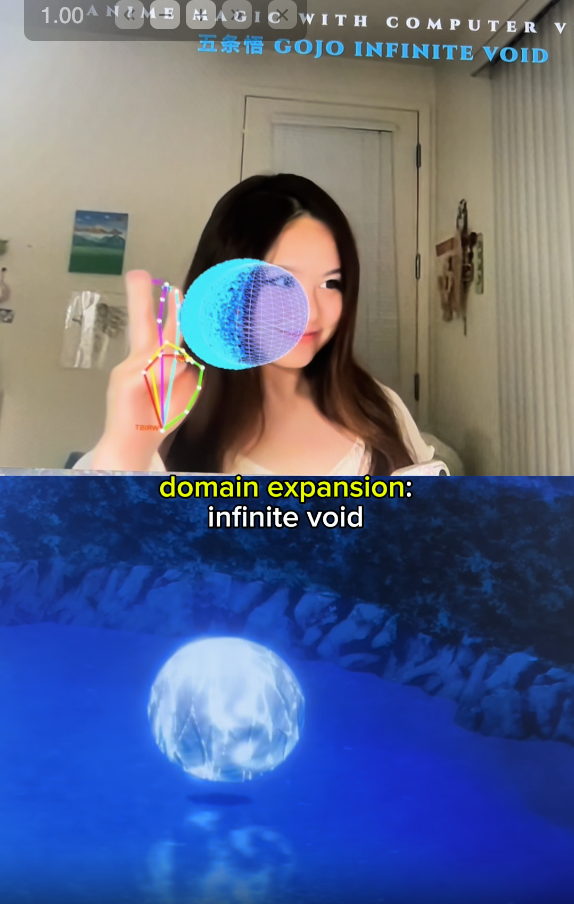

# Bring Anime to Life with Gesture-Based Magic Visualizations: Jujutsu Kaisen, Chainsaw Man, Madoka Magica

2/21/26

**By Amy Ouyang (amicornz@) 2026**

This project features complex particle and geometric visualizations with gesture-based motion control, bringing iconic anime moments to life through code.

Inspired by Alysa Liu's interview about her top 5 favorite anime.

**Website: https://amicorn.github.io/anime-magic/**

Full demos:
- [Computer vision demo of JJK, Chainsaw Man, and Madoka Magica spells](https://www.instagram.com/reel/DVHdSqrEvpS/)
- [Computer vision demo of Gojo JJK anime OST music video](https://www.instagram.com/reel/DVHkibCkh8b/)

## 🎬 Demo

A computer vision-powered visualization for Gojo's **Infinite Void** spell from *Jujutsu Kaisen*.

[Watch the Demo](https://github.com/user-attachments/assets/be6f739f-2c15-40f6-bc8a-4ded08156fff)

## 🏆 Featured Visualizations

| **Jujutsu Kaisen**  Gojo's Infinite Void) | **Madoka Magica**  Rune Gate / Magical Girl Transformation | **Chainsaw Man**  Aki's Kon (Fox Devil) Beast Summoning  |
| :---: | :---: | :---: |
|  |  |  |

## 📸 Visualization Gallery (Technical Overview)

This project maps real-time MediaPipe hand landmarks to Three.js coordinate systems. Below is the full visual mapping of the system states.

### 🧿 Jujutsu Kaisen: Infinite Void
| | | | |
| :---: | :---: | :---: | :---: |
|  |  |  |  |
| **Trigger Gesture** | **Sphere Creation** | **Burst Logic** | **State Release** |

---

### 🦊 Chainsaw Man: Aki's Kon
| | | | |
| :---: | :---: | :---: | :---: |
|  |  |  |  |
|  |  |  |  |
| **Hand Pose (A)** | **Hand Pose (B)** | **Trigger State** | **Effect Render** |

---

### 🌸 Madoka Magica: Rune Gate & Magical Girl Transformation
| | | | |
| :---: | :---: | :---: | :---: |
|  |  |  |  |
|  |  |  |  |
|  |  |  | |
| **Initial Pose** | **Gate Trigger** | **Pillar Physics** | **Release Phase** |

---

### ❤️ Doki Doki Hearts & System UI
| | | | |
| :---: | :---: | :---: | :---: |
|  |  |  |  |
|  | | | |
| **Heart Gesture** | **Particle Heart** | **Depth Mapping** | **Targeting** |

## ✨ Magic Spells List

This project features complex particle and geometric visualizations with gesture-based motion control, bringing iconic anime moments to life through code.

I built particle and geometric visualizations with gesture-based motion control for the following anime:

### 1. Gojo's Domain Expansion: Infinite Void (*Jujutsu Kaisen*)
- **Effect**: Crossing your third (middle) finger behind your second (index) finger creates a majestic blue sphere surrounded by swirling particles. Uncrossing your fingers "releases" the spell, causing the sphere and particles to dissolve and expand.
- **Reference**: [Gojo Uses Infinite Void](https://www.youtube.com/watch?v=nmvkhLz8t7I)

### 2. Chainsaw Man: Aki's Kon
- **Effect**: Touching your third (middle) and fourth (ring) fingers to your thumb while keeping your second (index) and fifth (pinky) fingers raised creates the "Kon" hand sign. This triggers an orange geometric triangular prism and a flurry of orange particles.
- **Reference**: [Aki Uses Kon](https://www.youtube.com/watch?v=IZ9yPVlwgzE)

### 3. Madoka Magica: Magical Girl Transformation
- **Effect**: Crossing both hands with palms visible to the camera triggers a complex pink and gold magical rune gate particle visualization.
- **Reference**: [Madoka's Transformation](https://www.youtube.com/watch?v=m3DjEiwaDsg)

### 4. Hearts to fangirl over Alysa Liu hehe
- **Effect**: Make a heart in any way with both hands, this will trigger a cute pink heart <3

## 🛠️ Technical Stack

I used the following web technologies to create this real-time interactive program:

- **Frontend**: HTML5, CSS3, JavaScript (ES6+)
- **Computer Vision**: [MediaPipe Hands](https://google.github.io/mediapipe/solutions/hands.html) for high-fidelity hand and finger tracking.
- **3D Graphics**: [Three.js](https://threejs.org/) for rendering complex particle systems and geometric shapes.
- **Mathematics**: Custom algorithms for gesture recognition, particle physics, and coordinate mapping from 2D camera space to 3D world space.

## 🚀 Features

- **Real-time Gesture Recognition**: Instantaneous detection of complex hand signs with high accuracy.
- **Dynamic Particle Systems**: Thousands of particles reacting in real-time to your hand's position and orientation.
- **Immersive Visuals**: High-fidelity 3D models and effects inspired by iconic anime cinematography.
- **Interactive Motion Control**: Control the size, position, and behavior of spells through intuitive physical movement.

## 💡 Inspiration

This project was inspired by **Alysa Liu's** relatable enthusiasm for anime in her [recent interview](https://www.youtube.com/shorts/wZbGHt6Y6JE), where she shared her top 5 favorites, including *Jujutsu Kaisen*, *Chainsaw Man*, and *Madoka Magica*.

---
